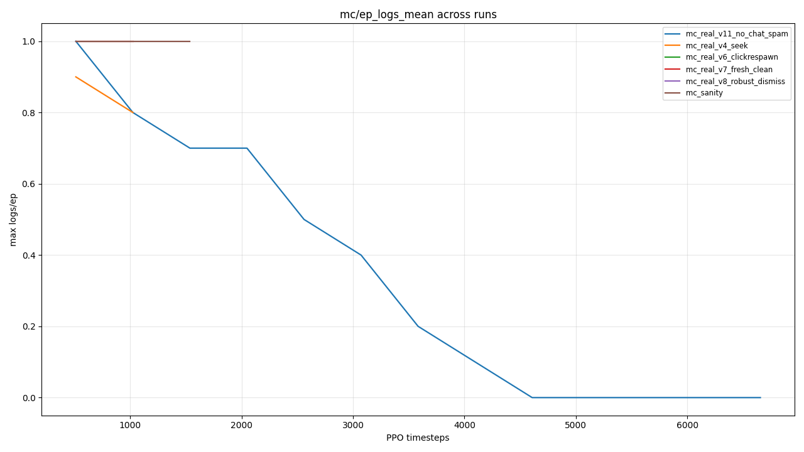

# mine-diamonds — Lightning Talk

> "I tried to teach a neural net to chop down a tree. The hard part
> wasn't the neural net."

A 5-minute story about building a real-Minecraft RL agent in a weekend
and the bug landscape that owns ~90% of the work that gets glossed over
in papers.

---

## 1. The setup (30s)

* **Goal:** chop a tree, get wooden tools, in the **real Minecraft Java
  client** — not a toy benchmark or a remote shim; the actual game window.
* **Why real?** Because every "we trained an agent on Minecraft"
  paper actually trained it on a thin shim, and the shim is doing 80%
  of the work. I wanted to feel that 80%.
* **Stack:**
  * Observation: `mss` screen-grab of the MC window → 84×84 RGB.
  * Action: Windows `SendInput` raw mouse + keyboard (MC needs raw
    mouse deltas; `SetCursorPos` is silently ignored once the cursor
    is captured).
  * Algorithm: stable-baselines3 PPO + CnnPolicy.
  * Reward: vision-based detector on a 1-block hotbar ROI (a log got
    picked up if pixel BGR diff vs. the empty-slot snapshot crosses a
    threshold).
* **Split:** the agent does perception (find tree, aim, swing). The
  recipe-book GUI choreography (planks → sticks → table → wooden
  pickaxe) is **hardcoded clicks**. Nobody learns to right-click a
  recipe — that's a UI script.

---

## 2. What got built (45s)

```
scripts/
  smoke_minecraft_real.py        end-to-end smoke test (capture + input + reward)
  train_ppo_minecraft_real.py    PPO training loop with TB callbacks + failsafe
  scripted_tree_chop.py          deterministic state-machine fallback
  craft_after_rl.py              recipe-book click-through to wooden pickaxe
  calibrate_inventory.py         click-anchor calibration for the inventory UI
  aggregate_metrics.py           TB → markdown table + chart for this talk
src/mine_diamonds/
  envs/minecraft_real.py         Gymnasium env wrapping the live game
  capture.py                     find the MC window via Win32 enum + sanity-check title
  input/                         SendInput + clipboard-paste chat helper
  scripted/                      recipe-book click sequences
  vision/pack_colors.py          BGR thresholds for the simple-colors pack
  failsafe.py                    F12-hotkey + STOP-file emergency release
```

Two things in there that aren't in any tutorial:

1. **`failsafe.py`** — runs a watcher thread; F12 (or touch a `STOP`
   file in the cwd) instantly releases every held key + mouse button
   and signals a graceful shutdown. After the first time the agent
   held W and seized my keyboard while I was trying to alt-F4, this
   stopped being optional.
2. **`capture.py`** — Win32 `EnumWindows` filtered to titles starting
   with "Minecraft", with an explicit deny-list for IDE/launcher
   windows that *also* contain "Minecraft" (Cursor's project tab,
   Discord notifications). Without this, the agent occasionally trains
   on screenshots of my IDE.

---

## 3. The bug landscape (the funny part — 2 minutes)

Every one of these I assumed would take 10 minutes and burned an hour.

### Bug 1: the reward detector "saw" logs that weren't there
Pixel-counting in the hotbar ROI fired on the empty texture-pack slot
because flat black (the log color) is also exactly slot-border black.

**Fix:** snapshot the empty slot at episode start, compare per-frame
mean BGR distance to that baseline. Diff-from-empty, not absolute count.

### Bug 2: the agent kept dying and never came back
Default MC respawn is a screen with a "Respawn" button. PPO's policy
has no idea it exists. `/gamerule doImmediateRespawn true` should fix
it — but the agent's first move post-death was usually to alt-tab and
*literally Google search "how to autorespawn in minecraft"* on Chrome.
(Loose mouse capture + a stuck LMB.)

**Fix:** programmatic dismiss — re-detect the MC window, focus it,
press Enter (the highlighted button), click as a backup but only if
the click coordinate is verified inside the MC rect. You'd be shocked
how often "click the respawn button" lands on Cursor's tab bar instead.

### Bug 3: 2 million chat commands
v10 added immortality buffs (`/effect give @s resistance ...`) so
gameplay deaths wouldn't break training. I put them in
`auto_reset_chat_commands` — which fires on *every* episode reset.
Episodes were ending every ~24s. 7 commands × ~6s of typing each ×
~150 resets/hour = the agent spent **most of its training time typing
slash commands**.

**Fix:** split chat commands into three buckets:
* `init_chat_commands` — once at the start of training (gamemode,
  gamerules, initial buffs).
* `post_respawn_chat_commands` — only after a `/kill` re-applies the
  buffs that respawning cleared.
* `auto_reset_chat_commands` — just `/clear @s`, the cheap one, on
  every episode boundary.

### Bug 4 — the smoking gun: the frozen-frame run

The day-of-talk run looked great for 10 minutes:

> `ep_logs_mean = 1.0`, `ep_aim_rate = 0.525`, `ep_approach_total = 5.71`

Then I came back 30 minutes later and my screen was on the desktop.
The agent had alt-tabbed away (probably stuck mouse + a window-edge
hit). PPO kept training. It "trained" for 25 more minutes on a frozen
desktop wallpaper.

The chat-command pipeline is the proof. While the chat box was open
and MC wasn't focused, every chat command got typed into Cursor:

```
scripts/Untitled              -> "/effect give @s minecraft:resistance ..."
scripts/w                     -> "/clear @sw wwww"
scripts/t/gamemode survival   -> empty file, named after a typed slash
                                 command that hit Cursor's "go to file"
                                 prompt
runs.jsonl                    -> "/clear @sw wwww"
```

Five mystery files appeared in my repo, *with content matching the
slash commands the agent was trying to send*. That's how I diagnosed
the crash: not from the metrics, from `git status`.

**Fix:** a window watchdog at every `reset()`. Re-detect MC; if it's
gone, busy-wait with a loud warning until I alt-tab back, instead of
silently capturing whatever's on top.

---

## 4. The numbers (45s)

`scripts/aggregate_metrics.py` reads every TB event file under `runs/`
and produces `docs/metrics/`. Headline table (peak across each run's
sliding-10 episode mean):

| run | steps | max logs/ep | max aim rate | max wood-on-screen | max return | episodes |
|---|---|---|---|---|---|---|
| `mc_real_v11_no_chat_spam` | 6,656 | 1.000 | 0.525 | 0.452 | 98.4 | 54 |
| `mc_real_v8_robust_dismiss` | 512   | 1.000 | 0.078 | 0.116 | 37.8 | 18 |
| `mc_real_v7_fresh_clean`   | 1,024 | 1.000 | 0.005 | 0.047 | 30.2 | 104 |
| `mc_real_v6_clickrespawn`  | 512   | 1.000 | 0.249 | 0.038 | 28.2 | 29 |
| `mc_real_v4_seek`          | 1,024 | 0.900 | 0.597 | 0.409 | 69.1 | 31 |
| `mc_sanity`                | 1,536 | 1.000 | 0.800 | —     | 38.4 | 21 |

What this says:

* **The agent CAN mine logs.** `max logs/ep ≈ 1.0` is reached in 5 out
  of 6 runs that produced any data. Vision detector + reward shaping
  + dense aim signal = trees do get chopped under policy.
* **It hasn't *learned* to mine logs reliably.** The peak comes from
  episodes where the agent stumbled into a tree. None of these runs
  were long enough for PPO updates to actually internalize that.
* **v11's curve is the frozen-frame collapse, made visible**:



v11 starts at 1.0 (the runs from the resumed checkpoint inheriting
last episode's log) and decays smoothly to 0 over ~4,000 steps as the
last successful episodes age out of the rolling-10 window. The
training never recovers — because there is nothing to recover *from*;
the env is photographing my desktop.

---

## 5. The demo (1 minute)

When the RL story is "it's almost there but I ran out of weekend,"
the live demo runs the deterministic version. State machine, ~150
lines of Python, no neural net:

```
scripts/scripted_tree_chop.py --craft pickaxe --countdown 8
```

States:

```
SCAN     no log pixels visible            yaw right in steady ticks,
                                          re-pitch every 3.6s
CENTER   log visible but off-center       yaw proportional to centroid
                                          offset; mild pitch correction
APPROACH log centered but small           hold W; auto-jump if fovea
                                          fraction stops growing
MINE     log fills enough of the fovea    hold W + LMB until slot 1
                                          changes from empty-baseline
DONE     N logs acquired                  release everything; hand off
                                          to scripted crafting
```

Crafting handoff calls `scripted/craft_table.py`:
`craft_planks_then_table()` → `get_wooden_pickaxe()`. Click the
recipe-book search bar, type "table", click result, drag table to
hotbar, place, repeat for the pickaxe.

The bot in the demo is the same vision pipeline + same input layer +
same screen-capture loop as the RL agent. **Only the policy is
different** — a state machine instead of a CNN. Which makes the same
point as a working RL agent would: the perception + action loop is
real and works.

---

## 6. Takeaway (15s)

Real-game RL papers ship the policy. The work is everything *under*
the policy:

* a screen capture that picks the right window,
* an input layer that survives lost focus,
* a reward signal robust to UI overlays,
* a reset that handles death without alt-tabbing to Chrome,
* a watchdog so the user can leave the laptop alone,
* and a failsafe so the user can take it back.

If you can do those six things, training a CNN to walk into a tree is
the easy part. We didn't quite get there in a weekend — but the
"hard part" works, and it's all in `src/mine_diamonds/`.
